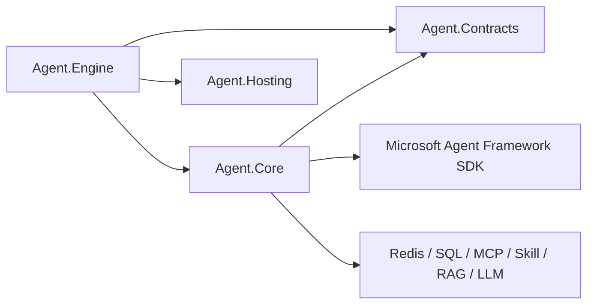
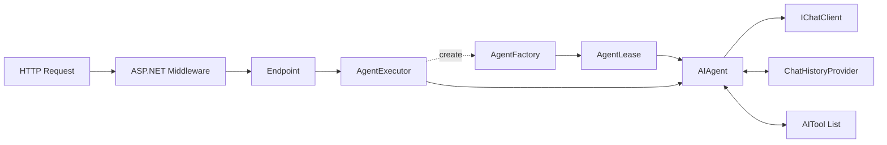
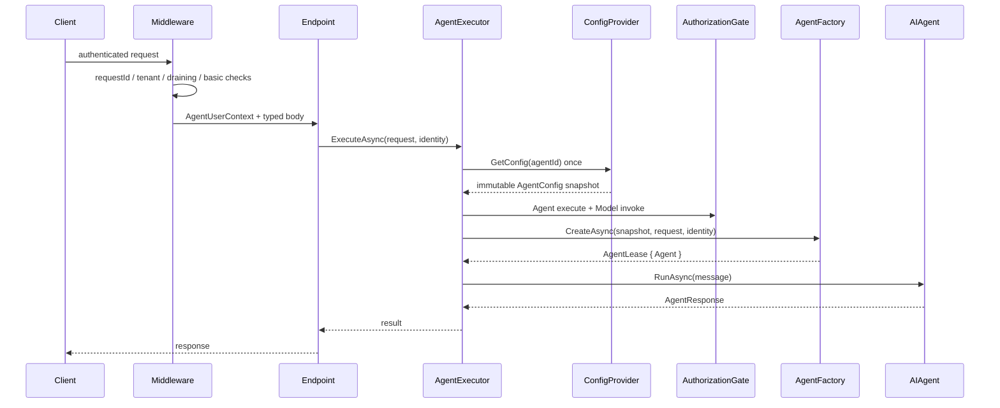

# OpenAgent Engine/Core Agent Runtime 扁平化产品与架构基线

> 状态：Implementation Baseline v5（核心重构已落地，真实环境验收待执行）
>
> 日期：2026-08-03
>
> 文档类型：产品范围、目标架构、迁移计划与验收基线
>
> 适用范围：`Agent.Engine`、`Agent.Core` 及其直接使用的 `Agent.Contracts`
>
> 文档规则：本文件是本轮 Agent Runtime 扁平化重构的唯一入口；Microsoft Agent Framework 仅是底层 SDK，不作为平台自有类型或目录的命名前缀

## 0. 产品边界与兼容基线

### 0.1 一句话目标

在保留 Engine/Core 对外功能和平台基础设施责任的前提下，把一次请求压平为：

```text
ASP.NET Middleware → Endpoint → AgentExecutor → AIAgent
```

底层 `AIAgent` 由 Microsoft Agent Framework SDK 提供，直接拥有 Agent loop、function loop、history lifecycle、streaming 和 compaction。平台只向它提供经过授权的模型、历史、工具与上下文 Provider，不在自有领域命名中暴露 SDK 品牌。

### 0.2 范围内与范围外

范围内：

- HTTP、NDJSON、multipart Agent 对话；
- Agent Runtime、模型调用、工具调用、usage 和 reasoning 映射；
- Conversation 历史、状态、分布式锁、查询、删除、热冷存储；
- MCP、Skill、RAG 的发现、调用、生命周期和 ACL；
- Agent/Model/Capability/Conversation 的身份与权限边界；
- Agent 配置、版本快照、热更新与 Secret 解析；
- Engine 注册、心跳、负载、健康、排空；
- 必要的请求日志、外部调用指标和错误边界。

范围外：

- Router、Channels、Workflow 的重写；
- 新建 Protocol/Runtime/Infrastructure 等项目级分层；
- 改造现有公开 API、Redis key 或 SQL schema；
- 人工审批和多 Agent Workflow；
- 为迁就旧测试、旧类名或旧文档保留无价值中间层。

### 0.3 必须保留的产品能力

| 领域 | 必须保留的行为 |
|---|---|
| 请求协议 | 同步、NDJSON、multipart；统一 request ID；流式唯一 `done` 终态 |
| Agent Runtime | SDK 原生 Agent/function loop、真流式、usage、reasoning、最大轮次 |
| 模型 | Provider Profile、多 API 格式、运行时参数、连接故障映射 |
| 会话 | tenant/owner 隔离、同会话串行、历史保真、取消/失败终态、查询/删除 |
| 上下文 | SDK `ChatHistoryProvider`、`AIContextProvider` 和原生 compaction |
| 附件 | 数量/大小/MIME 校验；文本、图片及受支持文档映射；仅保存必要元数据 |
| MCP | 传输、连接、工具发现、schema、调用、资源读取和取消传播 |
| Skill | 内置/动态/HTTP Skill 的显式启用、覆盖、调用和 ACL |
| RAG | 多实例搜索、tenant/user filter、结果合并、来源元数据和失败策略 |
| 安全 | 认证、租户、Agent/Model 前置 ACL、Capability 发现与执行双重 ACL |
| 配置 | 发布配置、不可变请求快照、版本、热更新、Secret、岛屿模式 |
| 节点 | 注册、心跳、负载、健康、排空和容器运行 |
| 可观测性 | HTTP、模型、Capability、后台任务四类边界；敏感数据不落日志 |

### 0.4 对外 API

本轮默认保持现有路径、DTO 和传输语义。所有入口在 Endpoint 完成有类型映射后进入同一个 `AgentExecutor`。

| 方法 | 路径 | 语义 |
|---|---|---|
| POST | `/api/v1/agent/chat` | 简化 DTO 同步执行 |
| POST | `/api/v1/agent/chat/stream` | NDJSON 执行 |
| POST | `/api/v1/agent/chat/attachments` | 带附件同步执行 |
| POST | `/api/v1/agent/chat/attachments/stream` | 带附件 NDJSON 执行 |
| GET | `/api/v1/agent/agents` | 已发布 Agent 列表 |
| GET | `/api/v1/agent/conversations` | 会话列表 |
| GET | `/api/v1/agent/conversations/search` | 会话搜索 |
| DELETE | `/api/v1/agent/conversations/{conversationId}` | 软删除会话 |
| GET | `/health`、`/health/live` | 存活 |
| GET | `/ready`、`/health/ready` | 就绪 |
| GET | `/metrics` | 按部署网络策略暴露指标 |

协议不变量：

- 认证失败、tenant 缺失、Engine draining、请求格式错误必须在创建 `AIAgent` 前结束；
- NDJSON 映射统一的内部事件模型；
- 流事件至少区分 `content`、`reasoning`、`tool_call`、`usage`、`heartbeat`、`error`、`done`；
- `error` 后不得继续输出 content，`done` 恰好一次；
- 客户端取消必须停止模型和外部能力调用，并释放会话锁与请求级 MCP 资源；
- 非流式错误使用 ProblemDetails；流式错误使用安全的 `error` 后跟 `done`；
- prompt、Secret、附件正文、完整工具参数和内部堆栈不得出现在客户端错误或普通日志中。

### 0.5 核心数据与安全顺序

目标实现必须保留这些有类型概念，不把它们重新塞入通用上下文字典：

- `AgentRequest`：AgentId、ConversationId、输入、附件、幂等键和上下文策略；
- `AgentUserContext`：UserId、TenantId、Roles、Groups、Claims、Audience；
- `AgentConfig`：版本、模型、最大轮次、上下文策略、启用能力和安全策略；
- `ConversationMessage`：稳定 message ID、sequence、content parts、tool call ID/name、partial 状态；
- `AuthorizationDecision`：subject、tenant、resource type/id、action、decision、policy version；
- `EngineNode`：engine ID、address、heartbeat、load、in-flight、state 和 API version。

一次执行的最小授权顺序：

1. 已认证且 tenant 有效；
2. Agent `execute`；
3. Model `invoke`；
4. 每项 Capability `discover`；
5. 每次 Capability `execute`；
6. Conversation tenant/owner；
7. RAG/存储 Provider 的 tenant 数据过滤。

缺少授权实现、授权超时、资源未配置或高风险 MCP Tool 没有批准机制时默认拒绝。开发环境若需要宽松策略，必须显式注册，生产环境不得隐式回退为 AllowAll。

### 0.6 请求快照与默认决策

每次执行只读取一次 Agent 配置，并形成请求内不可变事实：Agent 版本、模型配置、最大轮次、上下文策略、启用能力、授权策略版本和已解析 Secret。热更新只影响后续请求，Agent 执行中禁止重新读取配置。

| 产品决策 | 默认值 |
|---|---|
| 无 ConversationId 是否持久化 | 不持久化 |
| 同会话锁冲突 | 快速返回 409，不排队 |
| 推理内容 | 默认不输出 |
| 高风险 MCP Tool | 无审批能力时拒绝 |
| Redis 不可用时的有状态请求 | 拒绝，避免失去分布式串行保证 |
| RAG 全部实例失败 | 返回依赖失败，不伪装为零结果 |
| 附件二进制长期存储 | 本轮不做，只保留必要元数据 |
| SQL Provider | 保留 SQL Server；SQLite 仅本地模式 |
| 现有 API 兼容 | 默认保持，内部结构不得依赖旧实现 |

## 1. Review 结论

上一版架构把问题扩大成了项目级绿地重写，提出四个新项目、全新 Protocol、Runtime、Infrastructure 和 Engine 边界。这个方案虽然整齐，但超过了实际目标。

本次修订后的目标只有三个：

1. 保留现有 `Agent.Engine`、`Agent.Core` 和外部 API；
2. 把请求进入 Agent Runtime 之前的通用校验移到中间件或过滤器；
3. 让底层 `AIAgent` 只接收模型、历史、工具和压缩策略等 SDK 原生资源，不接收巨型平台上下文。

最终核心链路是：

```text
ASP.NET Middleware
  → Endpoint
    → AgentExecutor
      → AIAgent
```

其中：

- Middleware 处理跨请求的前置责任；
- `AgentExecutor` 用直线代码完成 Agent 配置和 Agent/Model 授权；
- `AgentFactory` 创建 `AIAgent` 并管理其请求级资源；
- Microsoft Agent Framework SDK 自己负责 Agent loop、function loop、history lifecycle 和 compaction；
- MCP、Skill、RAG 以 `AITool` 形式进入 `AIAgent`；
- 工具执行权限由 `AIFunction` 装饰器在调用时再次检查。

## 2. 本次重构范围

### 2.1 保留

- `Agent.Contracts`、`Agent.Core`、`Agent.Engine` 项目边界；
- Engine 当前 HTTP、NDJSON、multipart 协议；
- Agent 配置读取和热更新；
- SDK `ChatClientAgent`；
- Conversation 热存储、冷存储和分布式锁；
- MCP、Skill、RAG；
- Agent、Model、Capability ACL；
- 节点注册、健康检查和优雅停机。

### 2.2 调整

- 请求身份和租户只解析一次；
- AgentId、ConversationId 使用有类型字段，不再写入通用字典；
- 通用前置校验移到 ASP.NET middleware 或 endpoint filter；
- Core 的执行层合并为一个 `AgentExecutor`；
- `AIAgent` 构造只消费 SDK 原生资源；
- Capability 发现和执行统一为 `AITool`；
- 重复的 Skill/Tool registry 合并；
- 日志和指标集中到边界装饰器。

### 2.3 不做

- 不新增四个项目；
- 不重写 Router、Channels 或 Workflow；
- 不改变现有公开 API 路径；
- 不要求新的控制面协议；
- 不重做全部 Redis key 和 SQL schema；
- 不引入大型 Domain/Application/Infrastructure 分层；
- 不创建新的 `RunPreparation`、`ExecutionContext` 或 `RuntimeBinding` 聚合类；
- 不为每个类机械增加接口。

## 3. 核心设计原则

### 3.1 SDK 是实现细节，Agent Runtime 是平台概念

底层 `AIAgent` 只需要知道：

- 使用哪个 `IChatClient`；
- 使用哪个 `ChatHistoryProvider`；
- 有哪些 `AITool`；
- 使用哪些 `AIContextProvider`；
- Agent 的 temperature、max turns 等运行参数；
- 当前 user message 和附件。

底层 `AIAgent` 不需要知道：

- HTTP request；
- JWT claims 如何解析；
- Redis 配置键；
- Agent 配置如何热更新；
- ACL 服务如何查策略；
- Engine 节点状态；
- 日志 scope；
- trace 参数；
- 一个包含所有平台服务的上下文对象。

### 3.2 前置校验不进入 Agent loop

以下校验在创建 `AIAgent` 之前完成：

- 请求已认证；
- TenantId 存在；
- Engine 没有 draining；
- 请求字段有效；
- AgentId 有效；
- Agent 配置存在；
- Agent `execute` 被允许；
- 模型配置可解析；
- Model `invoke` 被允许；
- 附件与模型能力匹配。

这些校验失败时不创建 Agent session，也不连接 MCP。

### 3.3 不使用巨型上下文

禁止创建同时包含下列信息的对象：

- User/Tenant/Claims；
- AgentConfig/LlmConfig；
- Conversation store/lock；
- MCP clients；
- Skill/RAG services；
- Logger/trace/metrics；
- cancellation；
- 任意 `Dictionary<string, object>`；
- 几十个运行参数。

数据通过三种方式传递：

1. 请求固有字段使用有类型 `AgentRequest`；
2. 认证结果复用并收窄现有 `AgentUserContext`；
3. `AgentFactory` 返回只负责生命周期的 `AgentLease`。

### 3.4 依赖跟随功能

- MCP 依赖只进入 MCP capability source；
- Skill 依赖只进入 Skill capability source；
- RAG 依赖只进入 RAG capability source；
- Conversation store/lock 只进入 history factory；
- Model client factory 只进入 `AgentFactory`；
- ACL 只进入前置授权和授权工具装饰器；
- 日志和指标只进入 middleware/decorator/worker 边界。

没有任何一个类需要同时注入上述全部依赖。

### 3.5 去框架品牌化命名

平台按职责命名，不按底层依赖命名。Microsoft Agent Framework 的名称只出现在 NuGet、SDK 类型、官方行为说明和当前源码迁移证据中。

| 文档旧称 | 目标名称 | 处理 |
|---|---|---|
| `MafResourceFactory` + `MafAgentFactory` | `AgentFactory` | 合并为一个创建器 |
| `MafResources` | `AgentLease` | 收窄为 Agent 与 owned resources 的生命周期对象 |
| `IMafChatClientFactory` | `AgentChatClientFactory` | 按产物命名 |
| `Runtime/Maf` | `Runtime/Agent` | 目录表达平台功能，不表达供应商 |
| `MafMessageAdapter` | `AgentMessageAdapter` | 只负责消息转换 |
| `MafResponseAdapter` | `AgentResponseAdapter` | 只负责响应/流事件转换 |

后续若替换底层 Agent SDK，上述平台类型和目录不需要改名。禁止创建新的 `Maf*` 平台类型。
“Agent Runtime”只是架构分区名称，不新增一个同名万能包装类；运行入口仍然只有 `AgentExecutor`，SDK 对象创建集中在 `AgentFactory`。

## 4. 保留的项目边界



### 4.1 Agent.Engine

负责：

- ASP.NET Host；
- middleware 顺序；
- endpoint 和传输协议；
- 请求身份建立；
- Engine admission/draining；
- 配置同步和节点生命周期；
- composition root。

不负责：

- Agent loop；
- function loop；
- MCP/Skill/RAG 业务调用；
- Conversation history 的 SDK 映射。

### 4.2 Agent.Core

负责：

- `AgentExecutor`；
- `AIAgent` 创建与调用；
- 模型客户端适配；
- Conversation history provider；
- Capability sources；
- Capability ACL decorator；
- Conversation 存储和锁；
- RAG/Skill/MCP 适配。

### 4.3 Agent.Contracts

只保留跨项目实际使用的：

- API request/response；
- Agent 配置；
- Conversation storage ports；
- 安全主体和授权 port；
- 外部扩展确实需要实现的接口。

内部辅助类、resolver、SDK binding 和实现专用 record 不进入 Contracts。

## 5. 架构规划与目标请求链路

### 5.1 四个静态分区

四个分区用于组织职责和依赖，不表示请求必须逐层转发：

| 分区 | 位置 | 责任 | 禁止承担 |
|---|---|---|---|
| Transport | `Agent.Engine/src/Host` | Middleware、Endpoint、协议映射、流 writer | Agent 配置、工具发现、模型调用 |
| Application | `Agent.Core/src/Core/Execution` | `AgentExecutor` 用例、配置快照、Agent/Model ACL | HTTP 解析、SDK tool loop、外部协议细节 |
| Agent Runtime | `Agent.Core/src/Core/Runtime/Agent` | `AgentFactory`、`AgentLease`、SDK message/response adapter | tenant 策略存储、Redis key、业务编排 Pipeline |
| Platform Adapters | `Conversation`、`Capabilities`、`Security`、Engine `Config` | History、MCP/Skill/RAG、ACL、配置和持久化实现 | 再创建一套 Agent/function/history loop |

静态依赖方向：

```text
Transport → Application → Agent Runtime → Microsoft Agent Framework SDK
                         ↘ ports ← Platform Adapters
```

这些分区保留在现有 Engine/Core 项目内，不为形式上的分层新增程序集。Platform Adapters 是被注入的能力，不是每次请求都要穿过的串行层。

### 5.2 运行时调用深度



实线业务调用保持：

```text
Endpoint → AgentExecutor → AIAgent
```

`AgentFactory` 只在创建阶段装配对象，`AgentLease` 只管理释放；二者都没有 `Execute`/`Invoke` 转发方法，因此不计入业务调用层级。

### 5.3 同步时序



### 5.4 流式时序

同步和流式使用同一个 `AgentExecutor`、`AgentFactory` 和资源生命周期。差异只在最后调用：

- 同步：`AIAgent.RunAsync`；
- 流式：`AIAgent.RunStreamingAsync`。

SDK update 被映射成有类型事件，再由 Engine 写成 NDJSON。禁止用字符串前缀承载 usage/reasoning 等控制信息。

## 6. Middleware 设计

### 6.1 使用边界

Middleware 只处理真正的横切责任。它不能：

- 读取 Agent 配置；
- 创建 `AIAgent`；
- 发现 MCP tools；
- 加载 Conversation history；
- 执行模型调用；
- 保存业务结果。

### 6.2 顺序

```text
ExceptionBoundaryMiddleware
  → RequestIdMiddleware
    → ASP.NET Authentication
      → ASP.NET Authorization
        → AgentUserContextMiddleware
          → EngineAdmissionMiddleware
            → Endpoint
```

#### ExceptionBoundaryMiddleware

负责：

- 统一捕获 endpoint 及下游异常；
- 非流式映射 ProblemDetails；
- 已开始的 NDJSON 保持流式协议；
- 只记录一次最终失败；
- 不修改业务异常内容。

#### RequestIdMiddleware

负责：

- 读取合法的 correlation header 或生成 request ID；
- 建立日志 scope；
- 把 request ID 写入响应；
- 记录请求总耗时和活跃请求数。

request ID 不进入每个方法参数；需要时通过当前 HTTP/Activity 边界获取。

#### AgentUserContextMiddleware

负责从可信 `ClaimsPrincipal` 创建现有 `AgentUserContext`：

```text
AgentUserContext
├── UserId
├── TenantId
├── Roles
├── Groups
├── Claims
└── Audience
```

不新增第二个身份 Contract。收窄后的 `AgentUserContext` 是认证值对象，不是运行上下文：

- 不包含 AgentId；
- 不包含 ConversationId；
- 不包含 AgentConfig；
- 不包含 service；
- 不包含 logger；
- 不包含 trace。

它存放在 `HttpContext.Features`，Endpoint 读取后显式传给 Core。

#### EngineAdmissionMiddleware

负责：

- Engine 是否 draining；
- 全局并发是否超过上限；
- 请求 body 是否超过 Host 限制；
- 可选的 tenant 级请求速率入口。

它不做 Agent/Model/Tool ACL，因为这些校验依赖有类型业务资源。

### 6.3 Endpoint Filter

Endpoint filter 只做协议级校验：

- message 非空；
- AgentId 格式；
- ConversationId 格式；
- pagination 范围；
- multipart 文件数量、大小、MIME；
- context policy 数值范围。

通过后 Endpoint 只调用 `AgentExecutor`。

### 6.4 为什么不保留 Core Pipeline

当前自定义 pipeline 容易演变成：

```text
Pipeline
  → RequestBoundary
    → AccessValidation
      → IdentityResolution
        → AgentRun
          → AgentFactory
```

通用横切逻辑已经由 ASP.NET middleware 更自然地处理。Core 不需要再次构造一套 middleware pipeline。

需要非 HTTP 调用 Core 时，调用者必须直接提供经过认证的 `AgentUserContext`，`AgentExecutor` 仍会执行 Agent/Model ACL，因此安全边界不会只依赖 HTTP。

## 7. AgentExecutor

### 7.1 职责

`AgentExecutor` 是 Core 唯一执行入口。它不再被 Pipeline、AgentRun 或多个 resolver 包裹。

概念接口：

```csharp
internal sealed class AgentExecutor
{
    public Task<AgentResponse> ExecuteAsync(
        AgentRequest request,
        IAgentUserContext user,
        CancellationToken cancellationToken);

    public IAsyncEnumerable<AgentStreamEvent> ExecuteStreamAsync(
        AgentRequest request,
        IAgentUserContext user,
        CancellationToken cancellationToken);
}
```

### 7.2 依赖

只注入：

1. `IAgentConfigProvider`
2. `AgentAuthorizationGate`
3. `AgentFactory`

不注入：

- AgentIdResolver；
- ExecutionConfigResolver；
- UserContextBuilder；
- IdentityResolution；
- Conversation store；
- MCP client；
- Skill provider；
- RAG service；
- Logger；
- Telemetry；
- IServiceProvider。

### 7.3 直线执行

伪代码：

```csharp
AgentConfig config = await configs.GetRequiredAsync(
    request.AgentId,
    cancellationToken);

await authorization.EnsureAgentExecutionAsync(
    user,
    request.AgentId,
    cancellationToken);

LlmConfig model = config.ResolveModel();

await authorization.EnsureModelInvocationAsync(
    user,
    request.AgentId,
    model,
    cancellationToken);

await using AgentLease lease = await agentFactory.CreateAsync(
    config,
    model,
    request,
    user,
    cancellationToken);

return await lease.Agent.RunAsync(
    request.Input,
    cancellationToken);
```

这里没有 preparation pipeline，也没有把上述变量复制进一个大 record。

### 7.4 同步/流式共享逻辑

配置和授权使用私有方法共享，不抽象为新的 service：

```text
ResolveAndAuthorizeAsync
├── config provider
├── Agent ACL
├── model resolve
└── Model ACL
```

方法可以返回一个小型二元结果 `(AgentConfig Config, LlmConfig Model)`。只有当字段数量稳定且确有语义时才定义 `AuthorizedAgent` 值对象。

禁止将它扩展成包含 capabilities、history、logger、trace、stores 的上下文。

## 8. Agent Runtime 创建与生命周期

### 8.1 AgentLease

`AgentLease` 不是业务上下文，也不是执行器。它只把创建好的 `AIAgent` 与本次请求拥有的可释放资源绑定在一起：

```csharp
internal sealed class AgentLease(
    AIAgent agent,
    IReadOnlyList<IAsyncDisposable> ownedResources) : IAsyncDisposable
{
    public AIAgent Agent { get; } = agent;
    private readonly IReadOnlyList<IAsyncDisposable> _ownedResources = ownedResources;
}
```

它不包含：

- AgentUserContext；
- AgentConfig；
- ConversationId；
- ACL service；
- MCP configuration；
- store/lock service；
- logger/metrics；
- 任意字典上下文。

它没有 `RunAsync`、`InvokeAsync` 或业务分支。`DisposeAsync` 只按逆序释放请求级 MCP handle、history lease 等资源；共享连接池和 Singleton client 不归它释放。

### 8.2 AgentFactory

依赖：

1. `AgentChatClientFactory`
2. `ConversationHistoryFactory`
3. `CapabilityToolFactory`

Compaction/context provider 由 context policy 通过纯函数创建，不作为第四个注入依赖。

`AgentFactory.CreateAsync` 依次完成：

```text
Model config        → IChatClient
Conversation fields → ChatHistoryProvider + lock lease
Capability config   → IReadOnlyList<AITool> + request-owned handles
Context policy      → IReadOnlyList<AIContextProvider>
native resources    → ChatClientAgent/AIAgent
AIAgent + handles   → AgentLease
```

核心构造逻辑：

```csharp
IChatClient functionClient = new FunctionInvokingChatClient(
    chatClient);

AIAgent agent = new ChatClientAgent(
    functionClient,
    new ChatClientAgentOptions
    {
        ChatHistoryProvider = history,
        AIContextProviders = contextProviders,
        ChatOptions = new ChatOptions
        {
            Tools = tools,
            Temperature = options.Temperature
        }
    });

return new AgentLease(agent, ownedResources);
```

具体 SDK 属性以实施时锁定的 Microsoft Agent Framework 版本为准；这里约束的是平台资源边界，不把 SDK option 类型复制成一套平台 Contract。

`AgentFactory` 合并旧的“资源 Factory + Agent Factory”两层。它负责创建，不负责执行、授权决策、日志或响应映射；`AgentExecutor` 直接调用 `lease.Agent.RunAsync` 或 `RunStreamingAsync`，中间没有 invoker 转发层。

### 8.3 为什么保留 AgentLease

直接只返回 `AIAgent` 会丢失平台请求级资源的释放责任；把 handles 放回 `AgentExecutor` 又会让执行器知道 MCP/history 细节。`AgentLease` 使用 RAII/Lease 模式表达所有权，用一个无业务行为的小对象解决释放问题，不形成新的架构层。

## 9. Capability 设计

### 9.1 AIAgent 只看到 AITool

MCP、Skill、RAG 在进入 `AIAgent` 前统一成：

```text
AITool / AIFunction
├── Name
├── Description
├── JsonSchema
└── InvokeAsync
```

`AIAgent` 不感知：

- Tool 来自 MCP 还是 Skill；
- RAG 有多少实例；
- ACL 存储在哪里；
- MCP 连接如何复用；
- Skill endpoint 如何认证。

这些细节留在各 capability source。

### 9.2 CapabilitySource

只保留一个扩展接口：

```csharp
internal interface ICapabilitySource
{
    CapabilityKind Kind { get; }

    Task<IReadOnlyList<CapabilityTool>> CreateToolsAsync(
        AgentConfig config,
        IAgentUserContext user,
        CancellationToken cancellationToken);
}
```

实现：

- `McpCapabilitySource`
- `SkillCapabilitySource`
- `RagCapabilitySource`

每个实现只注入自己需要的依赖。

### 9.3 CapabilityTool

内部小型对象：

```text
CapabilityTool
├── ResourceId
├── Kind
├── AIFunction
└── optional ParentResourceId
```

它不复制 AgentConfig、UserContext、MCP Server Config 和全部 ACL 信息。

### 9.4 CapabilityToolFactory

依赖：

- `IEnumerable<ICapabilitySource>`；
- `AgentAuthorizationGate`。

流程：

1. 根据 AgentConfig 判断启用哪些 source；
2. 只调用启用的 source；
3. 对返回资源执行 `discover` ACL；
4. 未授权能力不提供给 `AIAgent`；
5. 为允许能力增加 `AuthorizedAIFunction` 装饰器；
6. 校验 runtime name 唯一；
7. 返回 `AITool` 列表。

### 9.5 AuthorizedAIFunction

Decorator 模式：

```text
AIAgent function call
  → AuthorizedAIFunction
    → execute ACL
      → Capability AOP metrics
        → actual MCP / Skill / RAG function
```

它只持有：

- resource identity；
- 当前主体的最小引用；
- authorization gate；
- inner `AIFunction`。

调用时再次执行 `execute`，避免 discover 后权限变化的 TOCTOU 问题。

### 9.6 不再重复的概念

删除或合并：

- `CapabilityDefinition` 和单独的 SDK binding 重复；
- Skill descriptor 到 Tool descriptor 的重复转换；
- Tool/Function 两套泛化 ACL；
- SkillService、SkillProvider、ToolRegistry 三套查询路径，收敛为 `SkillRegistry` 存储和单一 capability source；
- 把 schema 拼进 prompt 的逻辑；
- 通过字符串二次查找 MCP server/tool 的路径。

## 10. MCP

### 10.1 注入边界

`McpCapabilitySource` 只依赖：

- `McpClientPool`；
- `AgentAuthorizationGate`；
- 单一边界 logger。
- 可选 MCP connection policy。

它从 AgentConfig 读取启用的 Server，连接并列出 Tool，随后创建绑定到具体 `server + tool` 的 `AIFunction`。

### 10.2 调用绑定

每个 MCP function closure 固定：

- Server identity；
- 原始 tool name；
- schema；
- connection handle。

模型调用 runtime name 后不会再次跨 Server 搜索。

### 10.3 生命周期

- HTTP/SSE 连接可由 pool 复用；
- Stdio 默认请求级；
- 不同租户或凭据不共享连接；
- cancellation 传播到 connect/list/call；
- `AgentLease.DisposeAsync` 释放请求拥有的 handle；
- pool 本身由 DI 管理，不放入 request context。

### 10.4 ACL

暴露给 `AIAgent` 前：

- MCP Server `discover`；
- MCP Tool `discover`。

执行时：

- MCP Server `execute`；
- MCP Tool `execute`。

Microsoft Agent Framework SDK 不参与 ACL 决策，只调用已装饰的 function。

## 11. Skill

### 11.1 合并内部注册

使用一个 `SkillRegistry`：

```text
SkillRegistry
├── built-in skill manifests
└── published HTTP skill manifests
```

每个 manifest 包含：

- stable ID；
- name；
- description；
- schema；
- invoke delegate 或 endpoint binding；
- resource identity。

不再同时写入 `SkillService`、`SkillProvider` 和 `ToolRegistry`。

### 11.2 SkillCapabilitySource

流程：

1. 读取 AgentConfig 显式启用列表；
2. 从 `SkillRegistry` 获取对应 manifest；
3. 应用配置覆盖的描述/schema；
4. 创建 `AIFunction`；
5. 交给统一 CapabilityToolFactory 做 discover/execute ACL。

空启用列表返回空，不解释成全部启用。

## 12. RAG

### 12.1 暴露方式

`AIAgent` 只看到一个 `search_knowledge_base` function。

`RagCapabilitySource` 持有 RAG search use case；function closure 内部：

1. 获取 Agent 启用的实例；
2. 对实例做 execute ACL；
3. 携带 tenant/user filters 搜索；
4. 合并并排序结果；
5. 返回带 source metadata 的结果。

### 12.2 依赖边界

RagFlow/Qdrant adapter 只被 RAG service 使用，不注入 `AgentExecutor`、`AgentFactory` 或通用上下文。

## 13. Conversation

### 13.1 SDK 原生 History

Conversation 继续通过 `ChatHistoryProvider` 接入 `AIAgent`。它是必须保留的平台扩展，不是前置 preparation。

```text
AIAgent
  ↔ PlatformChatHistory
      → ConversationSessionStore
      → IConversationLock
```

### 13.2 Factory 降低注入

`ConversationHistoryFactory` 注入：

- `ConversationSessionStore`；
- `IConversationLock`。

创建出的 `PlatformChatHistory` 只保存本轮需要的：

- tenant/conversation/user/agent 标识；
- user input 和附件元数据；
- session store；
- lock。

它不保存：

- AgentConfig；
- LlmConfig；
- Capability services；
- authorization service；
- logger/trace 参数。

### 13.3 生命周期

- SDK 请求 history 时获取锁并加载；
- Agent 完成时保存新增 messages；
- Agent 失败/取消时保存部分状态；
- dispose 最终释放锁；
- 锁和 store 的正确性仍由现有 Conversation 模块承担。

### 13.4 不扩大本次范围

本次扁平化不要求重写热冷存储算法、Redis Lua 或 SQL schema。只有当这些组件存在重复调用入口时，才合并入口，不改变数据语义。

## 14. 配置解析

### 14.1 一次读取

每次请求只调用一次：

```text
IAgentConfigProvider.GetConfigAsync(agentId)
```

后续 model、capabilities、conversation policy 都使用同一个 `AgentConfig` 实例。

Agent 执行过程中禁止重新读取 Agent 配置。

### 14.2 模型解析

`ILlmRegistry.ResolveConfig(config.Llm)` 保留为一次纯解析。

解析结果直接交给：

- Model ACL；
- `AgentChatClientFactory`。

不再经过 `ExecutionConfigResolver → IdentityResolution → AgentIdentity → AgentFactory` 多次包装。

### 14.3 热更新

Config snapshot 和 hot reload 继续属于 Engine 控制面。它们只负责让 `IAgentConfigProvider` 返回正确配置，不进入请求执行类的依赖列表。

## 15. 身份与 ACL

### 15.1 身份只构造一次

删除请求体预读和字典重建流程：

- User/Tenant/Roles/Groups/Claims 来自 `AgentUserContextMiddleware`；
- AgentId 来自 endpoint route/body 的有类型绑定；
- ConversationId 来自有类型请求；
- ExternalContext 只保存真正的业务扩展值。

### 15.2 ACL 位置

| ACL | 执行位置 |
|---|---|
| authenticated/tenant | Middleware |
| Agent execute | AgentExecutor，创建 `AIAgent` 前 |
| Model invoke | AgentExecutor，创建 `AIAgent` 前 |
| Capability discover | CapabilityToolFactory，提供给 `AIAgent` 前 |
| Capability execute | AuthorizedAIFunction，实际调用前 |
| Conversation owner | Conversation query/history boundary |
| RAG data filter | RAG provider adapter |

### 15.3 默认拒绝

生产环境没有授权实现时不注册 AllowAll fallback。开发环境需要显式注册开发策略。

## 16. Observability

### 16.1 AOP 边界

只在以下位置记录：

1. HTTP request middleware；
2. `IChatClient` decorator；
3. `AuthorizedAIFunction` decorator；
4. background worker 顶层。

### 16.2 不注入 Logger 的类

- AgentExecutor；
- AgentFactory；
- AgentLease；
- CapabilityToolFactory；
- resolver/value mapper；
- PlatformChatHistory 的纯生命周期逻辑。

存储/网络 adapter 可以在真正吞掉并降级的地方记录一次；如果异常继续上抛，就不重复记录。

### 16.3 不传递的参数

- traceId；
- Activity；
- log scope；
- duration；
- endpoint name；
- telemetry context。

request ID 由 middleware scope 自动关联。HttpClient/Redis/SQL 的 tracing 使用框架 instrumentation，不创建业务 TraceContext。

## 17. DI 结构

### 17.1 Endpoint

Run endpoint 只注入：

- `AgentExecutor`；
- 流式端点额外注入一个 stream writer。

不再同时注入 pipeline、shutdown scope、request context writer、logger 和多种 helper。

### 17.2 生命周期

| 服务 | 生命周期 |
|---|---|
| AgentExecutor | Scoped |
| AgentFactory | Scoped |
| CapabilityToolFactory | Scoped |
| CapabilitySource | Scoped 或 Singleton，按其 client 生命周期 |
| ConversationHistoryFactory | Scoped |
| PlatformChatHistory | 普通请求对象，不注册 DI |
| AgentLease | 普通请求对象，不注册 DI |
| Config snapshot/registries | Singleton |
| MCP connection pool | Singleton |
| AgentUserContext | HttpContext feature，不重复注册 Scoped context |

### 17.3 构造函数预算

| 类 | 最大直接依赖 |
|---|---:|
| AgentExecutor | 3 |
| AgentFactory | 3 |
| CapabilityToolFactory | 2 |
| 单个 CapabilitySource | 3 |
| ConversationHistoryFactory | 2 |

超过预算必须先检查：

- 是否混入其他功能；
- 是否应由 factory 创建；
- 是否把 AOP 依赖注入了业务类；
- 是否存在重复 registry/resolver；
- 是否试图用一个 Facade 隐藏而非消除复杂度。

### 17.4 禁止 Service Locator

不使用 `IServiceProvider` 按 capability 类型动态取服务。能力扩展通过 `IEnumerable<ICapabilitySource>`，运行时按 `Kind` 选择。

## 18. 设计模式与使用边界

### 18.1 模式落点

| 模式 | 落点 | 解决的问题 | 不允许演变成 |
|---|---|---|---|
| Middleware / Chain of Responsibility | Host 前置校验 | 认证、request ID、admission、异常等横切责任短路 | Core 内第二套 Pipeline |
| Endpoint Filter | DTO、multipart、分页校验 | 协议错误在进入用例前结束 | 读取配置或执行 ACL 的业务层 |
| Application Service / Facade | `AgentExecutor` | 一个用例入口，以直线代码协调配置、授权、创建和执行 | 仅隐藏深层转发的万能 Facade |
| Factory | `AgentFactory` | 集中创建 SDK Agent、History、Tools、Context Providers | 返回巨型资源包的 Abstract Factory 链 |
| Lease / RAII | `AgentLease` | 明确请求级资源所有权和逆序释放 | 带配置、身份、ACL 的运行上下文 |
| Strategy | `ICapabilitySource`、模型/RAG adapter | 按能力或 Provider 类型替换实现 | 每种策略再复制一套执行流程 |
| Adapter | ChatClient、MCP、Skill、RAG adapter | 隔离外部 SDK 与协议 | 平台重写官方 SDK 协议 |
| Decorator | `AuthorizedAIFunction`、`IChatClient` metrics | 在真实调用点执行 ACL 和必要 AOP | 把 trace/logger 参数逐层传递 |
| Immutable Snapshot | 请求内 `AgentConfig` | 保证授权和实际调用使用同一版本 | 可在执行中重新读取的 mutable context |
| Repository（保留现有） | Conversation Store/Repository | 隔离热存储与冷存储 | 为所有简单查询机械增加 Repository |

### 18.2 模式协作关系

```text
Middleware / Filter
        ↓
AgentExecutor (Application Service)
        ├── immutable config snapshot
        ├── Agent/Model authorization
        └── AgentFactory (Factory)
              ├── provider adapters (Strategy + Adapter)
              ├── AuthorizedAIFunction (Decorator)
              └── AgentLease (Lease/RAII)
                    └── AIAgent
```

### 18.3 明确不采用

- 不使用 Mediator/Command Bus：当前只有一个执行用例，引入消息分发会增加一跳；
- 不使用 Core Pipeline：HTTP 横切责任已有 Middleware，Agent loop 已由 SDK 提供；
- 不使用 Service Locator：能力扩展通过 `IEnumerable<ICapabilitySource>`；
- 不使用巨型 Abstract Factory 返回几十项资源：`AgentFactory` 直接构造 `AIAgent`；
- 不使用 Observer 复制可观测性事件：只在 HTTP、模型、能力和 worker 边界记录；
- 不为每个具体类增加接口：只有多个实现、外部边界或测试替换确有需要时才抽象。

选择设计模式的判断标准只有两个：是否减少调用层级，是否让依赖只出现在真正使用它的功能中。

## 19. 类合并与删除清单

| 当前概念 | 目标处理 | 原因 |
|---|---|---|
| `IAgentPipeline` + `Pipeline` | 删除 | HTTP middleware + AgentExecutor 已覆盖 |
| `RequestBoundary` | 合并到 Engine exception/request middleware | AOP 不属于 Core |
| `AccessValidation` | 合并到 identity/admission middleware | 通用前置校验 |
| `AgentRun` | 合并到 AgentExecutor | 避免额外转发层 |
| `AgentIdResolver` | 删除 | AgentId 使用有类型字段 |
| `ExecutionConfigResolver` | 删除或内联 | 每请求只读一次配置 |
| `UserContextBuilder` | 合并到 AgentUserContextMiddleware | 身份只构造一次 |
| `IdentityResolution` | 删除 | AgentExecutor 直线完成配置与 ACL |
| `AgentIdentity` 大型绑定 | 删除 | 不再跨层复制配置和身份 |
| 现有 Agent 创建器 + 资源装配器 | 合并为 `AgentFactory` | 一次创建 `AIAgent`，删除两个 Factory 的转发 |
| `CapabilityRuntime` + 现有 SDK capability provider | 合并为 CapabilityToolFactory | 直接产出 AITool |
| `SkillService` + `SkillProvider` + `ToolRegistry` | 合并为 SkillRegistry | 单一 Skill 注册源 |
| `AgentRequestContext` | 删除；复用 AgentUserContext feature | 不再携带 Agent/Conversation/trace |
| `RequestScope` | 合并到 request middleware active counter | endpoint 不手工登记 |
| 重复 EngineLog 方法 | 删除/合并 | 每个失败边界只记录一次 |

以下保留但收窄：

- `PlatformChatHistory`；
- `ConversationSessionStore`；
- `McpClientPool`；
- `IAgentConfigProvider`；
- `AgentAuthorizationGate`；
- `AgentChatClientFactory`；
- RAG adapters；
- config snapshot/hot reload；
- node heartbeat/shutdown。

## 20. 目标目录调整

不新增项目，只在现有项目内按功能归位：

```text
Agent.Core/src/Core/
├── Runtime/Agent/
│   ├── AgentExecutor.cs
│   ├── AgentFactory.cs
│   ├── AgentLease.cs
│   ├── AgentChatClientFactory.cs
│   ├── AgentMessageAdapter.cs
│   └── AgentResponseAdapter.cs
├── Capabilities/
│   ├── CapabilityToolFactory.cs
│   ├── ICapabilitySource.cs
│   ├── Mcp/
│   ├── Skill/SkillRegistry.cs
│   └── Rag/
├── Conversation/
│   ├── ConversationHistoryFactory.cs
│   ├── PlatformChatHistory.cs
│   ├── Lock/
│   ├── Store/
│   └── Repository/
├── Security/
│   └── AgentAuthorizationGate.cs
└── Models/
    └── LlmRegistry.cs

Agent.Contracts/Requests/
└── AgentStreamEvent.cs

Agent.Engine/src/Host/
├── Middleware/
│   ├── ExceptionBoundaryMiddleware.cs
│   ├── RequestIdMiddleware.cs
│   ├── AgentUserContextMiddleware.cs
│   └── EngineAdmissionMiddleware.cs
├── Filters/
│   ├── AgentRequestValidationFilter.cs
│   └── AttachmentValidationFilter.cs
├── Endpoints/
│   ├── AgentEndpoints.cs
│   └── ConversationEndpoints.cs
├── Streaming/
│   └── NdjsonStreamWriter.cs
└── Program.cs
```

Engine 控制面现有 Config、Reload、Registry、Runtime 目录暂不迁移，避免把调用链扁平化扩大成全项目改名。

## 21. 迁移步骤

### Step 1：建立 HTTP 前置边界

1. 拆分并简化 `AgentRequestContextMiddleware`；
2. 不再预读 JSON body；
3. 把现有 `AgentUserContext` 放入 feature；
4. 把 request final log 和 active counter 移到 middleware；
5. endpoint 仍调用旧 pipeline，先保持行为。

验收：

- identity 只构造一次；
- request ID 不逐层传递；
- multipart 与 JSON 使用相同身份来源。

### Step 2：引入 AgentExecutor，移除 Core Pipeline

1. Endpoint 改为调用 `AgentExecutor`；
2. AgentExecutor 直线读取 config；
3. 直线完成 Agent/Model ACL；
4. 同步/流式共享解析方法；
5. 删除 `IAgentPipeline`、`Pipeline`、`RequestBoundary`、`AccessValidation`。

验收：

```text
Endpoint → AgentExecutor → 当前 SDK adapter
```

先把前置层压平，再合并 Agent 创建逻辑。

### Step 3：Agent 创建与生命周期合并

1. 将目标目录命名为 `Runtime/Agent`，SDK 名称不进入平台目录；
2. 合并现有资源装配与 Agent 创建逻辑为 `AgentFactory`；
3. 创建只包含 `AIAgent` 和 owned disposables 的 `AgentLease`；
4. 把 history、tools、compaction 作为 SDK 原生资源直接用于创建 `AIAgent`；
5. 删除 `AgentRun`、`AgentIdentity`、旧 Factory 和 resolver 链。

验收：

```text
Endpoint → AgentExecutor → AIAgent
```

且 `AgentExecutor` 直接调用 `AIAgent`，没有 invoker 或 Factory 执行转发层。

### Step 4：Capability 合并

1. 定义三个 `ICapabilitySource`；
2. 合并 `CapabilityRuntime` 和现有 SDK capability provider；
3. 引入 `AuthorizedAIFunction`；
4. 合并 Skill 三套 registry；
5. 保留 MCP/RAG 内部 adapter，不扩大重写。

验收：

- `AIAgent` 只接收 `AITool`；
- discover/execute ACL 均存在；
- MCP tool 固定绑定具体 Server；
- 没有巨型 Capability binding。

### Step 5：Conversation 和 observability 收尾

1. 增加 `ConversationHistoryFactory`；
2. `PlatformChatHistory` 只保留会话依赖；
3. endpoint 删除手工 `RequestScope`；
4. 合并重复 EngineLog；
5. 删除不再引用的 Contract 和 helper。

验收：

- Conversation 数据语义不变；
- 一个请求只有一个最终日志；
- 业务类不传 trace/log 参数；
- Core/Engine 项目边界不变。

## 22. 验收指标

### 22.1 层级

- [x] HTTP endpoint 到 `AIAgent` 只有一个业务层：`AgentExecutor`；
- [x] 不存在 Core 自定义 pipeline；
- [x] 不存在 preparation/context 聚合服务；
- [x] 不通过 `Dictionary<string, object>` 传递身份和配置；
- [x] 不存在同时注入配置、ACL、MCP、Skill、RAG、Conversation 全部 service 的 Factory。

### 22.2 DI

- [x] Endpoint 普通执行只注入 `AgentExecutor`；
- [x] AgentExecutor 不超过 3 个依赖；
- [x] AgentFactory 不超过 3 个依赖；
- [x] 单个 CapabilitySource 不超过 3 个依赖；
- [x] `AgentLease` 和 `PlatformChatHistory` 不注册为 DI service；
- [x] 不使用 Service Locator。

### 22.3 Agent Runtime

- [x] Agent loop 只由 Microsoft Agent Framework SDK 实现；
- [x] function loop 只由 `FunctionInvokingChatClient` 实现；
- [x] history 使用 SDK `ChatHistoryProvider`；
- [x] compaction 使用 SDK provider；
- [x] MCP/Skill/RAG 只以 `AITool` 进入 `AIAgent`；
- [x] usage/tool call/streaming 使用 SDK 有类型内容，不使用字符串控制标记。

### 22.4 安全

- [x] authenticated/tenant 校验发生在 middleware；
- [x] Agent/Model ACL 发生在创建 `AIAgent` 前；
- [x] Capability discover ACL 发生在提供给 `AIAgent` 前；
- [x] Capability execute ACL 发生在实际调用前；
- [x] Conversation owner/tenant 校验保留；
- [ ] 无生产 AllowAll fallback。

### 22.5 兼容

- [ ] 现有 API 路径不变；
- [ ] NDJSON/multipart 语义不变；
- [ ] Agent 配置格式默认不变；
- [ ] Conversation 热冷存储语义不变；
- [ ] Engine 注册、热更新、健康和停机行为不变；
- [ ] Router/Channels 无需同步重写。

## 23. 架构不变量

后续实现不得突破：

1. Engine/Core 项目边界保持；
2. Middleware 不读取 Agent 配置或调用 `AIAgent`；
3. AgentExecutor 不管理 MCP/Skill/RAG 具体协议；
4. AgentFactory 只创建对象，不执行 Agent/Model ACL，不记录业务日志，不暴露 `RunAsync` 转发；
5. AgentLease 只包含 `AIAgent` 和本请求拥有的可释放资源；
6. CapabilitySource 只依赖自身功能；
7. AIFunction 执行前必须重新授权；
8. PlatformChatHistory 只负责 SDK 会话历史生命周期；
9. config 每请求只解析一次；
10. 日志和指标不作为业务参数传递；
11. 新抽象必须减少依赖或分支，不能只转发调用；
12. 移除内部重复代码不等于改变公开功能。

## 24. 已确定的架构决策

1. 保留 Engine/Core/Contracts 项目边界和现有 API/数据语义；
2. 移除 Core 自定义 pipeline，通用前置校验进入 ASP.NET middleware/endpoint filter；
3. `AgentExecutor` 是唯一 Core 执行入口；
4. `AgentFactory` 合并 SDK Agent 创建与资源装配，只创建、不执行；
5. `AgentLease` 只管理 `AIAgent` 与请求级资源所有权；
6. 平台自有类型、目录和文档名不使用 `Maf`/`MAF` 前缀；
7. MCP/Skill/RAG 通过 `ICapabilitySource` 按需提供 `AITool`；
8. `AuthorizedAIFunction` 承担执行时 ACL；
9. Skill/Tool 重复 registry 合并；
10. 按五个可独立验收的步骤落地，不扩大为项目级绿地重写。

## 25. 完成定义

本文通过 Review 后，代码重构完成标准是：

```text
Endpoint → AgentExecutor → AIAgent
```

并且同时满足：

- 前置通用校验已由 middleware/filter 完成；
- AgentExecutor 使用直线代码完成配置和 Agent/Model ACL；
- `AIAgent` 只获得模型、history、tools、context providers 和运行参数；
- 没有巨型 request preparation/context/binding；
- 每类 capability 只引入自己的依赖；
- Conversation、配置热更新、节点治理和外部 API 功能保持；
- 删除旧 pipeline、resolver、重复 registry、重复日志和无用 Contract；
- 所有新增类都能用一句话说明唯一职责。

## 26. 历史风险转化为架构门槛

2026-07-24 的会话执行边界审查基于当时实现，文件路径和具体类已经可能变化，因此不保留旧修复方案；但其发现的安全、流式和数据完整性风险仍是本轮重构的强制验收项。下表描述行为门槛，不要求保留旧类。

| ID | 风险 | 新架构必须满足的门槛 |
|---|---|---|
| R-01 | 授权配置与 Agent 实际调用发生 TOCTOU | Agent/Model 授权、ChatClient、Tools 和 options 必须来自同一个请求快照；运行中不得重新取配置 |
| R-02 | ToolCallId 在流映射或持久化中丢失 | SDK tool-call/tool-result 的稳定 ID 必须贯穿内部事件、历史和重放；不得用 tool name 代替 call ID |
| R-03 | 消费端提前释放流导致没有终态 | 正常、失败、取消和枚举提前结束均需进入明确终态并释放锁/连接；dispose 不是无语义退出 |
| R-04 | 持久化失败被吞掉并伪装成功 | 保存结果必须有类型化成功/失败语义；关键写入失败不得只记日志后返回成功 |
| R-05 | Skill/MCP 吞掉取消信号 | `OperationCanceledException` 必须继续传播为取消；不能转换成普通工具错误或模型内容 |
| R-06 | 摘要使用错误 Agent 或模型 | compaction 必须绑定本请求已授权的 Agent/模型快照，优先使用 SDK 原生 provider |
| R-07 | 工具失败后重复保存 assistant partial | 每个 SDK update 只持久化一次；partial 合并必须按稳定 message/call ID 去重 |
| R-08 | 空输出被视为成功 | 无 content、无有效 tool result 且无明确 finish reason 时返回受控失败，不生成伪成功响应 |
| R-09 | ToolCallStart 在调用完成后才发布 | 工具开始事件必须在实际 invocation 前产生；完成/失败事件必须与同一 call ID 配对 |
| R-10 | 用名称前缀猜测能力来源 | MCP/Skill/RAG 来源和资源 ID 是绑定时元数据，不能从 runtime name 反推 |
| R-11 | 高风险 MCP 仅记录日志 | 高风险能力必须在执行门拒绝或进入真实审批；审计日志不是权限控制 |
| R-12 | MCP 被多个 Registry/Provider 重复拥有 | MCP 发现和绑定只有 `McpCapabilitySource` 一条路径；Skill 不再间接注册 MCP Tool |
| R-13 | 身份转换时伪造 `IsAuthenticated` | 身份只从可信 `ClaimsPrincipal` 构造一次；转换不得根据 user ID 是否为空猜测认证状态 |

这些门槛与旧测试无绑定关系。实现完成后应针对新边界重写测试，至少覆盖：配置热更新并发、tool-call 回放、流提前释放、保存失败、取消传播、摘要模型、空输出、事件顺序、来源身份、危险工具、重复注册和认证保真。

## 27. 产品级验收矩阵

| 场景 | 必须证明的结果 |
|---|---|
| 同步请求 | Endpoint 只调用 AgentExecutor；最终文本、conversation ID、usage 和 finish reason 正确 |
| 流式请求 | 真正调用 `RunStreamingAsync`；NDJSON 事件正确输出；`error`/`done` 终态唯一 |
| 配置热更新 | 在请求中途切换配置不会改变本次已授权模型、工具或策略 |
| 会话并发 | 同 tenant/conversation 串行；锁续租、取消和释放均可证明 |
| 历史重放 | 文本、附件元数据、tool call/result 和 call ID 保真 |
| 能力发现 | 未启用或 discover 未授权的 MCP/Skill/RAG 不提供给 `AIAgent` |
| 能力执行 | 每次 function call 都在真实调用前重新执行 resource-aware ACL |
| 失败与取消 | 外部调用、保存和模型错误不会被伪装为成功；取消沿完整链路传播 |
| 依赖结构 | Endpoint 1 个核心依赖；AgentExecutor 至多 3 个；没有 Service Locator 或巨型上下文 |
| 可观测性 | 每请求只记录一次最终状态；模型/能力/后台任务仅在边界记录；不传 trace 参数 |
| 兼容性 | 现有 API、配置和会话数据语义保持；Router/Channels 无需同步重写 |
| 代码清理 | 旧 Pipeline、resolver、重复 registry、无用 Contract 和重复日志无残留引用 |

非功能门槛：

- 请求链层级以可读代码和依赖图证明，不能用 Facade 隐藏同样深的调用；
- 同一请求的配置与授权事实一致；同一会话状态单调推进；
- Redis、SQL、MCP、Skill、RAG、模型 Provider 的降级策略明确且默认 fail closed；
- 业务类无需读取 `HttpContext`、Activity、日志 scope 或通用 service provider；
- 未完成真实环境验证的行为必须标注为待验收，不能用历史测试数量代替。

## 28. 当前源码证据入口

本节只记录功能从哪里发现，用于实施时重新扫描；它不要求保留当前类或目录。

| 功能 | 生产源码入口 |
|---|---|
| HTTP/NDJSON/会话 API | `Backend/src/OpenAgent.Engine.Host/Extensions/EndpointExtensions.cs` |
| multipart 附件 | `Backend/src/OpenAgent.Engine.Host/Extensions/AttachmentEndpointExtensions.cs`、`Engine.Host/Attachments/` |
| 请求身份和租户 | `Backend/src/OpenAgent.Engine.Host/Middleware/AgentUserContextMiddleware.cs`、`EngineAdmissionMiddleware.cs` |
| Agent SDK adapter 与资源 | `Backend/src/OpenAgent.Core/Runtime/Agent/` |
| Capability 与执行授权 | `Backend/src/OpenAgent.Core/Capabilities/`、`Security/` |
| MCP | `Backend/src/OpenAgent.Core/Capabilities/Mcp/` |
| Skill | `Backend/src/OpenAgent.Core/Capabilities/Skill/`、`Backend/src/OpenAgent.Engine/Redis/RedisSkillRegistrar.cs` |
| RAG | `Backend/src/OpenAgent.Core/Capabilities/Rag/` |
| 会话、锁和历史 | `Backend/src/OpenAgent.Core/Conversation/` |
| 配置、快照和热更新 | `Backend/src/OpenAgent.Engine/Config/`、`Reload/` |
| 节点、心跳和排空 | `Backend/src/OpenAgent.Engine/Registry/`、`Runtime/` |
| 健康和指标 | `Backend/src/OpenAgent.Engine/Redis/`、`Backend/src/OpenAgent.Hosting/BuilderExtensions.cs` |

## 29. 文档收敛记录

本文件已吸收并替代以下内容：

- 早期 Microsoft Agent Framework 替代可行性：保留“SDK 负责 Agent runtime、平台保留基础设施”的边界；删除版本化外部调研和旧占比结论；
- 一次性替换计划与报告：保留 API/Provider/附件/ACL 兼容目标；删除旧调用链、旧类清单和历史测试数字；
- SDK 会话执行边界审查：把 13 项发现转成 R-01 至 R-13 行为门槛；删除已失效的文件行号与旧接口建议；
- SDK 原生运行时 redesign：保留原生 history/tool/context/compaction 和最小可观测性原则；由更扁平的 Endpoint → AgentExecutor → AIAgent 取代旧层级；
- Engine/Core 产品定义：保留产品能力、API、安全、可靠性和默认决策；压缩掉重复逐条描述；
- Engine/Core 扁平架构：作为本文主体，补齐产品范围与历史风险后成为唯一入口；
- 全仓 SRP 计划、对抗性审查与处置报告：保留下述长期架构约束，删除旧四引擎结构、逐类拆分步骤、Router/Channels 整改过程、旧代码行号、提交号和历史测试数字。

历史 SRP 工作留下的有效约束统一为：

1. 依赖方向保持 `Contracts → Core → Engine`；Router、Channels 等服务不得反向渗入 Core，Microsoft Agent Framework SDK 类型不得扩散到 Contracts；
2. 内部类型、目录和依赖可以大胆重写，但现有 HTTP/JSON/流式协议、程序集名称、公开类型和数据语义的破坏性变化必须单独评审；
3. DI 生命周期跟随状态所有权：请求状态不得进入 Singleton，HostedService 依赖必须线程安全，纯函数和请求内资源对象不注册 DI；
4. `HttpContext`、日志、Activity 和 metrics 只存在于边界；Core 业务类不读取 HTTP，也不为了可观测性增加参数或依赖；
5. MCP 和 Microsoft Agent Framework 等官方 SDK 已提供的传输、协议、function loop 和 session lifecycle 不在平台重复实现；平台只保留授权、租户、持久化和协议适配；
6. 重构验证必须覆盖依赖方向、DI 构建、流式顺序、取消传播、tool-call 保真与资源释放；真实 SSO、Redis、LLM、Jenkins 和 TestChat 验收不能由单元测试替代；
7. 历史报告、旧测试数量和旧文件路径不作为现状证据。实施时重新扫描源码，并同步正式模块文档；仓库协作规则以 `AGENTS.md` 和 `.agent/` 为准。

完成本次收敛后，`Todo/` 只保留本文。新的 Agent Runtime 扁平化设计变更直接更新本文，不再创建可行性、计划、报告和 review 的平行版本。
