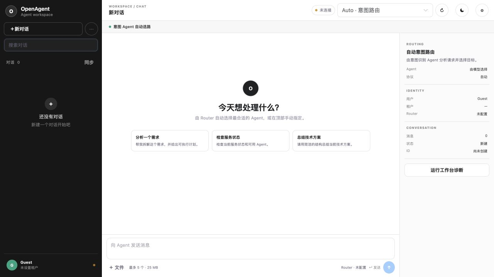
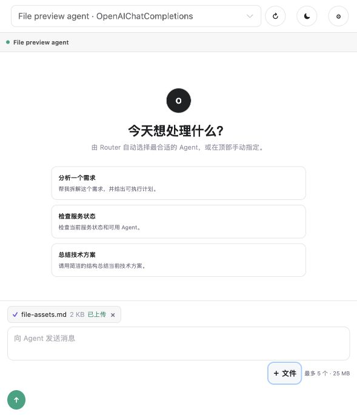
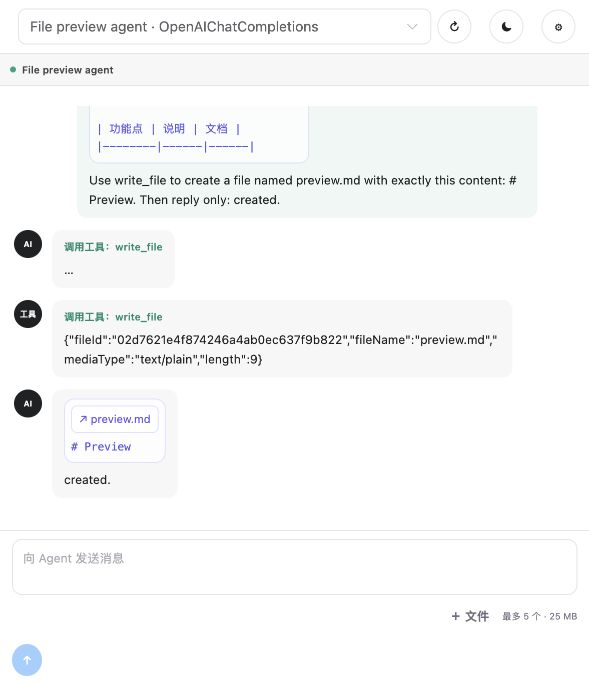

# 文件存储重构：本地测试报告

**执行日期：** 2026-08-11
**分支：** `codex/file-assets-main-rewrite`
**结论：** 后端、前端、PostgreSQL migration、MinIO 文件往返以及 Kimi 真实模型的普通/SSE 文件回合均通过；界面已实测独立上传反馈、用户消息预览和模型生成文件预览。

> 更新（2026-08-12）：已使用临时 Kimi `kimi-k2.6` 配置完成真实模型和 SSE 文件链路验证，结果见“真实模型端到端验证”。

## 可视化证据

下图为本地运行的 OpenAgent Chat 工作台。底部 Composer 显示独立的“+ 文件”入口及
“最多 5 个 · 25 MB”约束；文件不再作为聊天 multipart 请求的一部分。



### 本轮 UI 回归截图（2026-08-12）

真实选择 `docs/integrations/file-assets.md` 后，Composer 立即调用独立上传端点；在
上传完成前发送按钮保持不可用，完成后显示 `✓`、文件名、大小和“已上传”，发送按钮启用：



随后向真实 Kimi `kimi-k2.6` 发起携带该 `fileId` 的会话，并要求它调用 `write_file`
创建 `preview.md`。截图上方是用户消息内的已绑定 Markdown 内容预览，底部是助手消息内
模型生成文件的卡片和 `# Preview` 内容预览：



## 验证矩阵

| 项目 | 实际命令或操作 | 结果 | 证据 |
|---|---|---|---|
| 后端编译 | `dotnet build Backend/OpenAgent.sln --no-restore` | 通过，0 warning、0 error | 14 个项目均编译成功 |
| 后端回归 | `dotnet test Backend/OpenAgent.sln --no-build` | 通过，181/181 | Contracts 5、Core 57、Hosting 9、Architecture 6、Router 56、Engine 47、Persistence 1 |
| PostgreSQL 集成 | Testcontainers PostgreSQL | 通过 | migration、独立文件资产、同一文件的会话/消息复用关联均通过 |
| EF migration 管理 | `dotnet-ef migrations list` | 通过 | 发现 `202608110001_InitialOpenAgentPostgres`，同时提交模型快照 |
| 前端生产构建 | `pnpm --dir Frontend/OpenAgent.Chat build` | 通过 | `vue-tsc` 与 Vite 构建完成 |
| Docker 依赖 | `docker compose -f docker-compose.storage.yml ps` | 通过 | PostgreSQL 16、MinIO 均为 `healthy` |
| 实际上传与下载 | 宿主启动后 `POST /api/v1/agent/files`，再 `GET /content` | 通过 | 上传后的 `state=1 (Ready)`，下载内容哈希匹配 |
| 变更完整性 | `git diff --check` | 通过 | 无空白错误 |

## 实际文件资产证据

本次冒烟上传 `docs/integrations/file-assets.md` 后，文件元数据端点实际返回：

```json
{
  "fileId": "c745f86af1e44857ac63d463f0bc0495",
  "tenantId": "development",
  "ownerUserId": "development-user",
  "fileName": "file-assets.md",
  "mediaType": "text/markdown",
  "length": 1365,
  "sha256": "fdab9c818008ff7cd9e2dc24ff88f465cccb08864abd7475139167fce2fa1f80",
  "source": 0,
  "state": 1
}
```

源文件与通过认证下载端点取回的内容均为：

```text
fdab9c818008ff7cd9e2dc24ff88f465cccb08864abd7475139167fce2fa1f80
```

这证明 PostgreSQL 中的文件元数据与 MinIO 中的实际对象可互相对应，且下载内容未被修改。

## 已知非阻塞项

- Vite 报告 VueUse 的 `PURE` 注释位置和单个 bundle 大小建议，构建成功，未阻塞交付。

## 真实模型端到端验证

测试使用用户提供的 Kimi OpenAI 兼容 endpoint；凭据仅作为启动进程中的临时输入使用，未写入仓库、配置文件、数据库或本报告。

| 步骤 | 结果 |
|---|---|
| `GET /v1/models` 连通性检查 | HTTP 200，约 1.9 秒 |
| `POST /api/v1/agent/chat`，携带现有 `fileId` | 通过，模型返回 `文件资产与对象存储` |
| `POST /api/v1/agent/chat/stream`，携带同一 `fileId` | 通过，SSE `content` 返回同一标题，随后 `done`；`PromptTokens=483`、`CompletionTokens=60`、`TotalTokens=543` |
| PostgreSQL 回查 | 两个 E2E 会话均有消息级文件引用：非流式会话 2 条、流式会话 1 条 |

模型要求 `temperature=1`；初次使用 `0` 时服务端返回 `invalid temperature: only 1 is allowed for this model`。改为 `1` 后，普通与流式调用均成功。

另外，开发环境没有 Redis 时需要先通过开发管理端点注册 LLM Profile，才可使 Agent 配置中的 `provider=kimi` 被运行时 Registry 解析。这与文件存储无关，但说明 Engine 的配置/Registry 仍保留 Redis 协调边界。

## 本轮消息预览回归（2026-08-12）

本轮使用浏览器实际操作（而非接口模拟）完成如下闭环：

1. 在 Composer 选择 Markdown 文件，看到 `已上传` 状态后才可发送。
2. 发送携带该资产的消息；用户气泡显示 `file-assets.md` 及其完整 Markdown 文本预览。
3. Kimi 调用 `write_file` 创建 `kimi-output.md`，工具返回文件资产 ID。
4. 会话刷新后，助手气泡显示 `preview.md` 和 `# Preview` 预览。
5. PostgreSQL 回查确认同一会话的用户消息关联 `file-assets.md`，助手消息关联 `kimi-output.md`；两者均为 `text/markdown`。本次紧凑 UI 回归的 `preview.md` 未显式传递 media type，因而为 `text/plain`，同样按 `text/*` 规则展示预览。

其中第 3 步模型响应有约一分钟的工具回合延迟，最终成功返回 `created.`；这属于远端模型响应时间，未触发本地重试或模拟结果。
