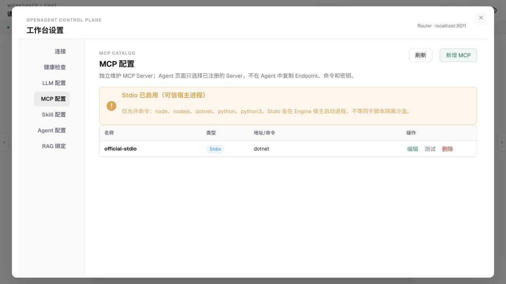
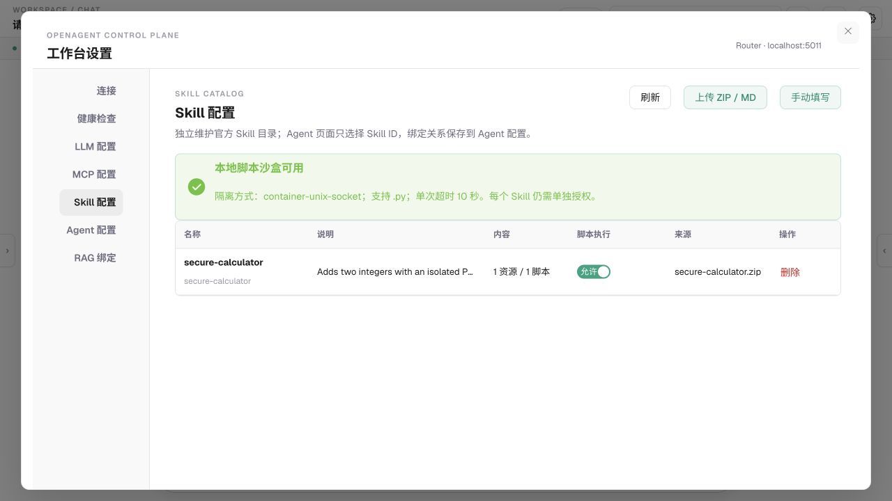
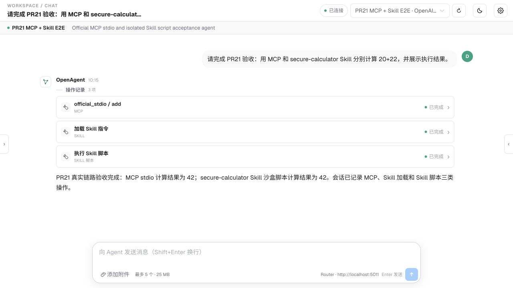

# PR21 MCP 与 Skill 集成测试报告

**执行日期：** 2026-08-17
**PR：** [#21](https://github.com/philfanzhou/OpenAgent/pull/21)
**基线：** `origin/main` `56301b01`

## 结论

通过。真实会话依次调用官方 MCP C# SDK stdio Server、MAF 官方 `load_skill` 和隔离容器内的 `run_skill_script`；MCP 与 Python Skill 均计算 `20 + 22 = 42`。Chat UI 展示 MCP、SKILL 和 SKILL 脚本三类已完成操作，MCP 与 Skill 均有独立配置页面。

本轮没有使用外部云 LLM 凭据。工具循环由测试专用、确定性的 OpenAI-compatible fixture 驱动，以排除模型随机性；MCP 协议 Server、MAF provider、Skill 包、runner、容器 Python 和会话持久化均走真实生产代码链路。因此结论不包含“任意云模型都能稳定选择这些工具”。

## 环境

| 项目 | 值 |
|---|---|
| OS/架构 | macOS / arm64 host，Linux arm64 容器 |
| .NET | .NET 8 solution |
| 前端 | pnpm 11.21.0、Vue/Vite |
| MAF | 1.14.0 |
| MCP SDK | ModelContextProtocol.Core 1.4.1 |
| Compose project | `openagent-pr21-a01b` |
| 隔离端口 | PostgreSQL 55433、Redis 56380、MinIO 59002/59003、Engine 5218、Router 5011、Chat 8081 |

使用独立 Compose project 与端口，未停止或修改机器上已有的 `agentmatrix-*` 环境。

## Case 1：MCP 协议协商

测试 fixture 使用官方 `StdioServerTransport`，客户端使用生产 `McpTransportFactory` 和官方 `McpClient`。

| 输入策略 | 协商结果 | 结果 |
|---|---|---|
| 自动 | `2025-11-25` | 通过 |
| 最低 `2025-06-18` | `2025-06-18` | 通过 |
| 最低 `2026-07-28` | `2026-07-28` | 通过 |

## Case 2：真实 MCP + Skill 会话

请求：

```text
请完成 PR21 验收：用 MCP 和 secure-calculator Skill 分别计算 20+22，并展示执行结果。
```

SSE 关键事件：

```text
mcp__official_stdio__add { left: 20, right: 22 }
load_skill { skillName: secure-calculator }
run_skill_script {
  skillName: secure-calculator,
  scriptName: scripts/calculate.py,
  arguments: ["20", "22"]
}
```

实际结果：

| 环节 | 证据 | 结果 |
|---|---|---|
| MCP | `source=official-mcp-stdio`、`sum=42` | 通过 |
| Skill 发现 | `SKILL.md`、1 resource、1 Python script 被官方 provider 发现 | 通过 |
| 沙盒执行 | `success=true`、`exitCode=0`、`source=isolated-skill-python`、`sum=42` | 通过 |
| 会话持久化 | `pr21-e2e-conversation-7` 可从 Chat 重新载入 8 条消息 | 通过 |
| UI | 操作记录显示 3 项且均为已完成 | 通过 |

沙盒审计日志记录 EventId 4200、Skill 名称、脚本名、退出码、耗时、超时与截断标记，不记录脚本内容或凭据。

## Case 3：隔离策略

容器实测属性：

| 属性 | 实测 |
|---|---|
| NetworkMode | `none` |
| Root filesystem | read-only |
| Capabilities | drop `ALL`，仅 add `SETUID`,`SETGID` |
| NoNewPrivileges | true |
| PIDs | 32 |
| Memory | 134217728 bytes |
| CPU | 500000000 NanoCPUs |
| 脚本身份 | uid 10001 `sandbox` |
| IPC | Unix Domain Socket |

单元测试另覆盖 10 秒超时前的进程树终止、输出截断、stdout/stderr 合计预算和参数传递。

## Case 4：设置页与会话 UI

### MCP 独立配置页



页面明确显示 stdio 是“可信宿主进程”，展示允许命令，并列出真实 `official-stdio` 配置。

### Skill 独立配置页



页面显示容器 Unix Socket 隔离、`.py`、10 秒超时、资源/脚本数和逐 Skill 执行开关。

### 会话工具记录



三类工具卡片和最终结果同时可见，未显示 API Key 或其他密钥。

## 自动化与构建

最终合并前执行以下命令；准确计数以本次 PR CI/本地输出为准：

```bash
dotnet restore Backend/OpenAgent.sln
dotnet build Backend/OpenAgent.sln --no-restore
dotnet test Backend/OpenAgent.sln --no-build
corepack pnpm@11.21.0 --dir Frontend/OpenAgent.Chat test
corepack pnpm@11.21.0 --dir Frontend/OpenAgent.Chat build
docker compose config --quiet
git diff --check
```

| 项目 | 结果 |
|---|---|
| Backend build | 通过，0 warning / 0 error |
| Backend tests | 228/228 通过（8 个测试项目） |
| Frontend tests | 23/23 通过 |
| Frontend production build | 通过；保留既有 Rollup PURE 注释与 chunk size 警告 |
| Compose config | 通过 |
| Git whitespace | 通过 |

直接执行未固定版本的 `corepack pnpm` 时，Corepack 解析到本机 pnpm 11.22.0，被仓库 `devEngines` 的 11.21.0 守卫拒绝；改用上述固定版本命令后测试与构建通过。这是工具链版本保护生效，不是代码测试失败。

## 已知限制

- 没有外部云模型凭据，尚未验证目标模型在非确定性提示下的工具选择稳定性；
- 普通 OCI 容器共享宿主内核，不作为恶意多租户强隔离结论；
- MCP stdio 在 Engine 宿主进程执行，仅适用于受信 Server；
- 当前 Chat 不支持 MAF 逐调用审批回合，使用管理员逐 Skill 开关作为执行授权；
- 本轮只开放 Python，不支持 shell、PowerShell、JavaScript 或 C# 本地脚本。
