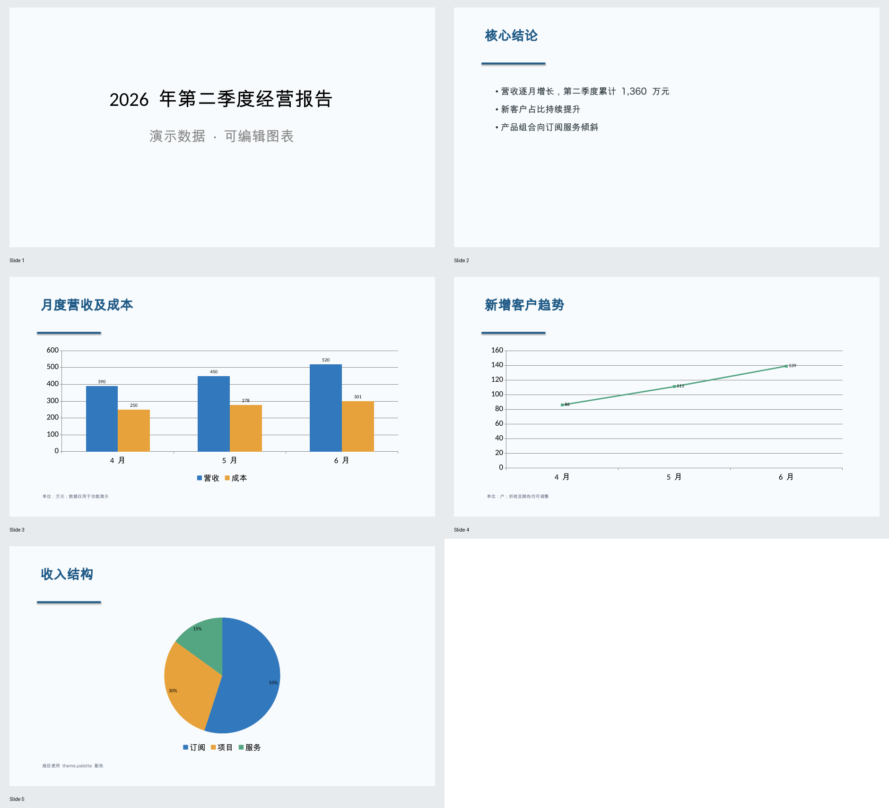

# Agent.Matrix 数据报告 PPTX 案例

这是可上传到 Agent.Matrix 的 Skill 包。输入 JSON 数据，输出可编辑 PPTX；柱状、条形、折线和饼图都是 PowerPoint 原生图表。案例数据见 `resources/example.json`。

## 使用

直接上传本目录的 `data-pptx-skill.zip` 到 Agent.Matrix 管理端。为该 Skill 开启脚本执行，并将 Skill 和 CodeExecution 绑定到同一个 Agent；宿主必须配置隔离 Runner。具体开关及权限要求见 [`docs/modules/capabilities/skill/README.md`](../../../docs/modules/capabilities/skill/README.md)。ZIP 内包含 `SKILL.md`、生成脚本、示例数据及空白 PPTX 模板。

已生成的演示文件是 `demo-output.pptx`；`demo-preview.png` 是实际渲染结果的五页缩略图。演示文件与预览图不包含在上传 ZIP 中。



对话中可要求：

> 使用 data-pptx Skill，按案例数据生成 PPT。将“月度营收及成本”改为横向条形图，营收用 `#6B5B95`，显示数值标签；使用我上传的空白公司模板（含版式，无现成幻灯片），输出可编辑的 PPTX。

脚本调用参数是一个元素的数组：`[{...报告 JSON...}]`。需要用户自有模板时，先通过 `execute_code` 的 `inputFiles` 挂载上传的模板，并复制到同一会话的 `/work/company-template.pptx`；再把 JSON 的 `template` 设为该路径。也可用 `write_workspace_file` 把较大的 JSON 数据写成 `/work/report.json`，脚本参数传 `["/work/report.json"]`。生成的文件为 `/output/report.pptx`，应使用 `publish_files` 交付。

模板必须是包含母版与版式、但没有现成幻灯片的 `.pptx`。生成过程沿用其页面尺寸与所选版式；案例模板为 16:9。`layouts.title` 和 `layouts.content` 可填版式索引或名称。字段含义与可配置图表项见 `resources/example.json` 和 `SKILL.md`。

本案例用 Runner 已安装的 `python-pptx`；无需下载上游 PPTAgent 的浏览器转换依赖。[上游 PPTAgent Skill](https://github.com/icip-cas/PPTAgent/tree/833cda553b343be0e486a93b0b57cac962cdd566/skills/pptagent) 以 HTML 幻灯片及视觉审阅为核心，目前不提供本案例所需的 JSON 原生图表及 PPTX 模板调用接口，因此这里提供与 Agent.Matrix 执行边界匹配的独立 Skill 案例。

## 本地验证

用 Runner 对齐的 `python-pptx==1.0.2` 运行：

```bash
python -m unittest discover -s tests -v
python scripts/generate.py resources/example.json /tmp/data-pptx-case.pptx
```

使用 LibreOffice 打开或渲染生成的文件，可复核版式；单看 ZIP 有效不代表页面视觉质量合格。
